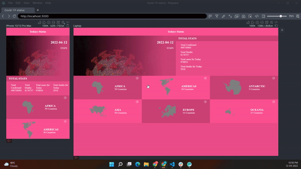

# Covid19-Status

This web app gives you the data of Covid19 like total cases, total deaths, active cases, recovered cases etc based on the countries. All countries are categorized into regions which makes it easier to look for needed data.

### Live link

- [@Link](https://covid19status-stats.netlify.app/)

- [@Link to demo](https://www.loom.com/share/4e11bd2e407740bfbabc8138b6ef4608)

Additional description about the project and its features.

## Tools used

- React.js
- Css Modules
- npm
- React Icons
- React testing library.

## Api used

- https://restcountries.com/v3.1/all
- https://api.covid19tracking.narrativa.com/api/

## Prerequisites

The basic requirements for building the executable are:

- A working browser application (Google chrome, Mozilla Fire fox, Microsoft edge ...)
- VSCode or any other equivalent code editor
- Node Package Manager (For running, debuging, or installing dependancies to be used)

## Available scripts

### `npm install`

To install all the dependencies to run and debug the application in local environment.

### `npm start`

Runs the app in the development mode.
Open [http://localhost:8080](http://localhost:8080) to view it in the browser.

### `npm run build`

Builds the app for production to the `build` folder.
It correctly bundles the app in production mode and optimizes the build for the best performance.

#### Cloning the project

git clone https://github.com/muneebulrehman/Covid-19-status.git

## Author

👤 **Muneeb Ul Rehman**

- GitHub: [@Muneeb](https://github.com/muneebulrehman)
- Twitter: [@NeatCoder\_](https://twitter.com/NeatCoder_)
- LinkedIn: [Muneeb](https://www.linkedin.com/in/muneeb-ul-rehman-33903b159/)

Contributions, issues, and feature requests are welcome!

Feel free to check the [issues page](https://github.com/muneebulrehman/Covid-19-status/issues).

## Show your support

Give a ⭐️ if you like this project!

## Acknowledgements
 
 Thanks to [Nelson Sakwa](behance.net/sakwadesignstudio) from behance for providing the desing.
